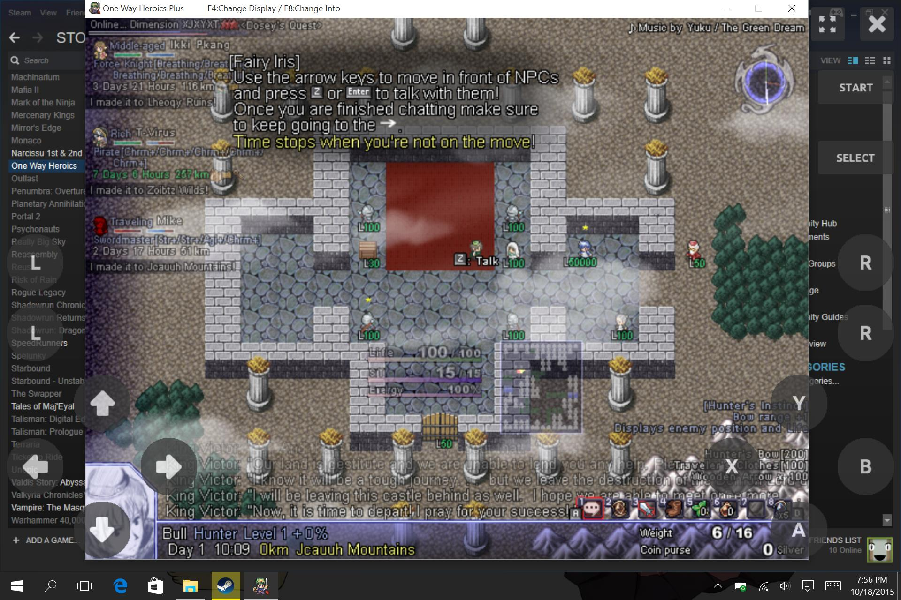

TouchJoy - On screen gamepad for touch-screen Windows devices
=============================================================

## What is it?

This program helps you create an on-screen gamepad so that you can game on a touch-enabled Windows device:

The layout is fully customizable using a simple [ini file](data/sample.ini).
The file is also automatically reloaded whenever it is saved so that you can tweak and adjust it quickly.

## Why?

I want to play Windows games lying down and there are not many good on-screen gamepad applications for Windows.
It is also a chance to learn how far I can go with only C99 and as few external libraries as possible.

## How to build?

You need [GENie](https://github.com/bkaradzic/genie) and Visual Studio 2013+ since the project is written in C99.

`vs2013.bat` can be used to generate a solution for Visual Studio 2013.

## How to use?

For now, the code and [this sample](data/sample.ini) are the only manuals.
I'm terribly sorry.

## External libraries

* [stb_image](https://github.com/nothings/stb): image loading
* [gb_ini](https://github.com/gingerBill/gb): ini parsing
* [utest](https://github.com/evolutional/utest): unit testing

Special thanks to Sean Barrett for providing an useful [list](https://github.com/nothings/stb/blob/master/docs/other_libs.md) of single-header libraries.
